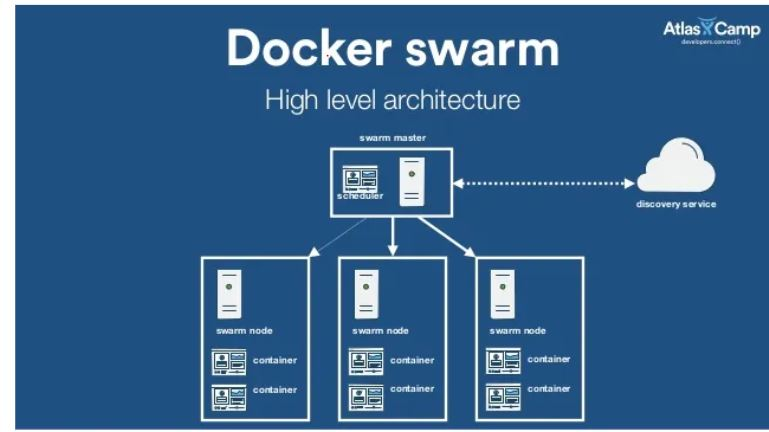

# AIM: SETUP THE INFRASTRUCTURE USING TERRAFORM,then USING GITHUB ACTIONS FOR AUTOPROVISIONING.
## Architectural Sample for the Docker swarm


Requirements:
- AWS Account as user
- Terraform configured ( Could use the docker compose file to set it up)
- AWS CLI installed and credentials configured.
- Ansible setup


## TO BE ACCOMPLISHED
- [x] Building and pushing the Docker images to Amazon ECR (This step is accomplished on the [Backend Repo](https://github.com/AppsLab-KE/backend-everyshilling.git)
- [x] Setting up Infrastructure (Uses Terraform as the IAC tool)
- [x] Setting up  Autoprovisioning pipeline (can be viewed from the .github/workflow/main.yml file)
- [ ] The playbook.yml and inventory folder are ansible setup that deploys the swarm cluster.
- [x] Ensuring all the services are up and running (deployment)
- [x] Testing the services once the Swarm Cluster is deployed.
-  Creating DNS Record for the Load Balancer's
- Setting up ssl security

 Click the 'Use this Template' button for your initial setup


## Setting up the infrastructure locally

### To run all the Terraform commands at once locally execute :

```
 chmod +x terraform_script.sh and 
 ```

```
./terraform_script.sh
```

 This provisions the infrastructure for the first time,and from the output copy those ip addresses key to the hosts file under [inventory](inventory)


 Once all the configurations is set,run the terraform script again ```./terraform_script.sh ``` then this command from the ansible playbook which deploys the cluster

 ```
ansible-playbook -i inventory/hosts playbook.yml
 ```

The swarm cluster should now be ready.To check the cluster use ssh in manager node:

```
ssh -i your_key_file.pem ubuntu@manager_public_ip
sudo docker node ls`

```


### BLABLABLA OTHER DOCUMENTATIONS

 Configuring Terraform files(Initialize,plan and apply): 
 
 ```
terraform init
 ```

```
terraform plan  -var-file=tfvars/dev.tfvars 
```
 &&
 
```
terraform apply -var-file=tfvars/dev.tfvars 
```
To terminate the infrastructure :
terraform destroy -var-file=tfvars/dev.tfvars

Doing terraform apply provisions the Docker Swarm resources, VPC with 3 instances (Worker and master)
The shell script install_dockercompose.sh installs docker and docker compose in your servers.

### Configuration Management

Ansible script responsible for creating the swarm cluster (a manager and two worker node)

The inventory/hosts directory should be changed to the ec2 instances ip addresses to enable ssh.

 Ansible Playbook command:

 ```
 ansible-playbook -i inventory/hosts playbook.yml
 ```

### AWS CREDENTIALS
- To generate keys
ssh-keygen
cat ./ssh/id_rsa.pub
aws configure --profile (set your profile)

- Incase faced with lock state key. [Solution](https://stackoverflow.com/questions/62189825/terraform-error-acquiring-the-state-lock-conditionalcheckfailedexception)


### Worried about installing Terraform on your machine ? use Docker image (docker-compose.yml file)
Commands to run the file: 

```docker-compose up ```

```docker-compose run --rm tf init
```

```docker compose run --rm tf fmt
```

```docker-compose run --rm tf validate
```

docker run -d -it --name terraform-ubuntu ubuntu


